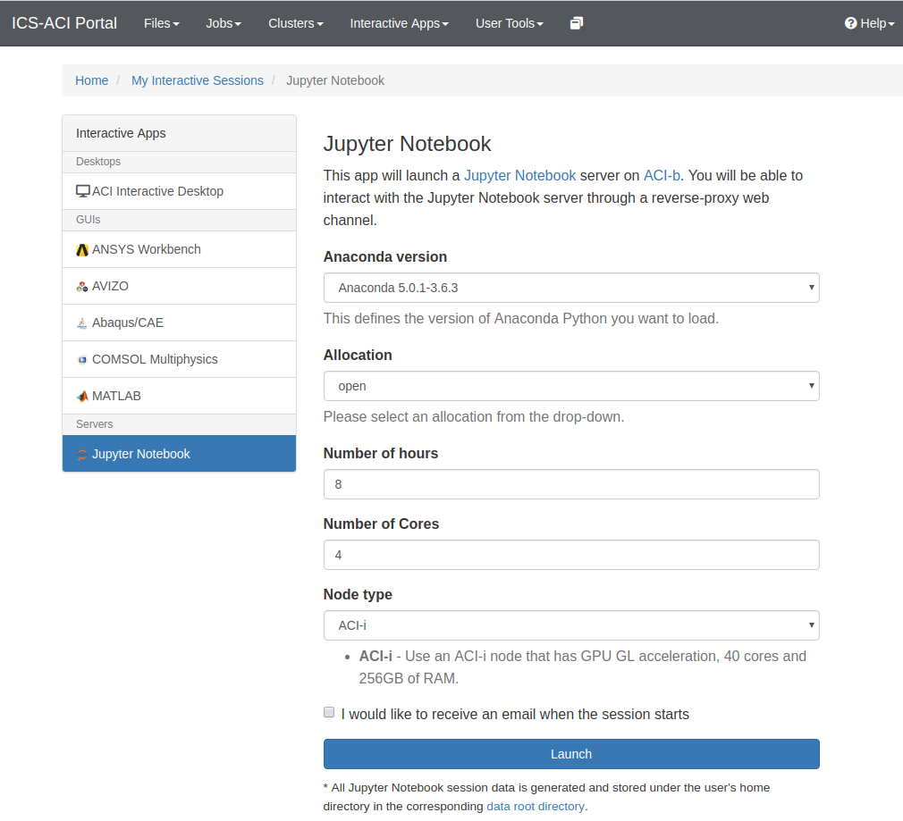

# Astro 528 Lab 5

For exercise 2, you will need to use multiple processor cores.  If you're using Julia installed on your own machine, then you don't need to do anything special before starting the lab. 
However, if you'll be using the ACI portal to access the Jupyter notebook server, then you need to request multiple processor cores when you first submit the request for the Jupyter notebook server using the box labeled "Number of Cores", i.e. before you start executing cells in this notebook. 

While we're in class, please ask for just 4 cores, since there are likely nearly ~20 of us using the system at once. (If you're using the ICS-ACI portal to request a remote desktop, then as of writing this lab it gives everyone exactly four cores, with no option to change.)
If you return to working on the lab outside of class, then feel free to try benchmarking the code using 8 cores or even 16 cores. If you do ask for several cores, then please be extra diligent about closing your session when you're done.

## Exercise 1:  Probabilistic Programming & Uncertainty Estimation
#### Goals:  
- Read a model written in probabilistic programming language
- Write a model using a probabilistic programming language
- Estimate uncertainties in model parameters using Markov chain Monte Carlo 

From your Jupyter notebook server, work through ex1.ipynb

## Exercise 2:  Parallelization for Multi-Core Workstations 
#### Goals: 
- Choose an appropriate number of worker processors for your compute node
- Load code and packages on worker nodes
- Parallelize code using pmap 
- Parallelize code using SharedArray's
- Parallelize code using map and mapreduce on DistributedArray's
- Parallelize code using @distributed for loop
- Parallelize code using Threads.@threads

Along the way: 
- Organize code into files and a [module](https://docs.julialang.org/en/v1/manual/modules/index.html)
- Reinforce using  [function-like objects](https://docs.julialang.org/en/v1/manual/methods/#Function-like-objects-1)
- Reinforce using [broadcasting](https://docs.julialang.org/en/v1/base/arrays/#Broadcast-and-vectorization-1)
- Practice using [abstract types](https://docs.julialang.org/en/v1/manual/types/#Abstract-Types-1)
- Practice using [parametric types](https://docs.julialang.org/en/v1/manual/types/#Parametric-Types-1)

From your Jupyter notebook server, work through ex2.ipynb.  Remember to make sure you have access to multiple cores for this exercise.  

Remember to commit often, push your repository to GitHub and create a pull request as if you wanted to merge your work (presumably in your master branch) into the original branch (which contains the starter code). 

